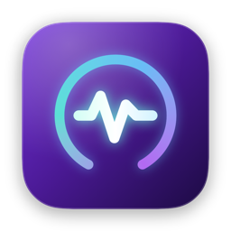

# MonClean

App thanh menu macOS theo dõi tài nguyên máy. Nhẹ hơn CleanMyMac khoảng 6 lần
về RAM và hơn 1000 lần về dung lượng cài đặt.



## Hiển thị gì

| Chỉ số | Nguồn |
|---|---|
| CPU: tải, nhiệt độ, biểu đồ | `host_statistics` + AppleSMC (`Tp*`) |
| GPU: tải, nhiệt độ | IORegistry `IOAccelerator` + AppleSMC (`Tg*`) |
| Bộ nhớ: dùng / tổng, tách App–Wired–Nén | `host_statistics64` |
| Ổ đĩa: dung lượng trống | `URLResourceValues` |
| Nguồn: watt máy tiêu thụ và watt sạc | `AppleSmartBattery` → `BatteryData` |
| Pin: phần trăm, số chu kỳ | `IOPSCopyPowerSourcesInfo` |
| Mạng: tốc độ lên/xuống | `getifaddrs` → `if_data` |
| Áp lực nhiệt | `ProcessInfo.thermalState` |
| Top tiến trình ngốn CPU/RAM | `ps` |

## Nhiệt độ CPU/GPU không cần quyền root

`powermetrics` bắt buộc chạy bằng superuser, nên hầu hết công cụ đo nhiệt phải
cài một helper chạy quyền root. MonClean không cần: `AppleSMC` mở được bằng
quyền người dùng thường qua `IOServiceOpen`.

Lúc khởi động, app duyệt toàn bộ ~3500 khoá SMC một lần ở luồng nền để tìm cảm
biến nào thực sự tồn tại trên máy, rồi mỗi 2 giây chỉ đọc đúng những khoá đó.
Cách này không phụ thuộc vào bảng khoá cứng nên chạy được trên mọi đời chip.

Tiền tố khoá trên Apple Silicon: `Tp*` P-core · `Tg*` GPU · `Tm*` RAM ·
`Ts*` vỏ máy · `TA*` môi trường.

## Dựng

```bash
./build.sh      # biên dịch, đóng gói, cài vào /Applications
./makeicon.sh   # vẽ lại icon từ IconView.swift rồi sinh AppIcon.icns
./preview.sh    # render giao diện ra /tmp/preview.png để xem không cần mở app
```

Chỉ cần Xcode Command Line Tools, không cần project Xcode và không có dependency.

## Tự chạy khi đăng nhập

Dùng `SMAppService`, hiện đúng trong System Settings › General › Login Items.

```bash
/Applications/MonClean.app/Contents/MacOS/MonClean --login on|off|status
```

Hoặc bấm công tắc ở chân cửa sổ app.

## Cấu trúc

```
Sources/App.swift             điểm vào, MenuBarExtra
Sources/SystemMonitor.swift   lấy mẫu mọi chỉ số
Sources/SMC.swift             đọc cảm biến nhiệt qua AppleSMC
Sources/LaunchAtLogin.swift   SMAppService, dự phòng LaunchAgent
Sources/MonitorView.swift     giao diện
Sources/IconView.swift        icon vẽ bằng SwiftUI
Preview/                      render giao diện và icon ra PNG
Attic/                        tính năng dọn cache đã gỡ, giữ lại tham khảo
```

## Yêu cầu

macOS 13 trở lên, Apple Silicon.
